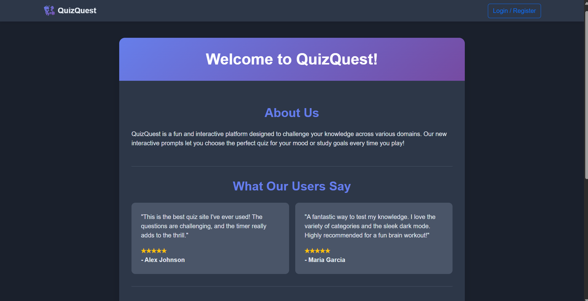

# QuizQuest: A Gamified Quiz Experience

A dynamic, single-page web application that offers a fun, gamified quiz experience. Built with pure **HTML, CSS, and JavaScript**, this app features a complete user authentication system and an interactive prompt-based engine to generate personalized quizzes for students, exam aspirants, and working professionals.

**Live Demo:** [Link to your live site] ---

## ✨ Features

- **Interactive Quiz Personalization:** Instead of static categories, users are guided through a series of prompts before each quiz to select a topic that matches their current goals.
- **Targeted Question Banks:** Features specialized 10-question quizzes tailored for:
  - **Working Professionals:** (Lawyer, Doctor, Engineer)
  - **Exam Aspirants:** (JEE, NEET)
  - **General Students**
- **Real User Authentication:** A complete user registration and login system that persists sessions using the browser's `localStorage`.
- **Protected Routes:** Non-authenticated users can only access the homepage and authentication forms. All other pages are protected.
- **Dynamic Leaderboard:** The leaderboard updates in real-time with points earned (100 for a pass) or lost (150 for a fail), with a score floor of 0.
- **Gamified Experience:** Each question has a 10-second timer with an audible beep for the last 3 seconds to increase the thrill.
- **Instant Feedback:** See correct and incorrect answers immediately after selection.
- **Streamlined User Profile:** A clean profile page to manage personal information.
- **Fully Responsive:** Works beautifully on desktops, tablets, and mobile devices.

---

## 📂 File Structure
```
quizquest/
│
├── index.html               # Main HTML skeleton/entry point
│
├── css/
│   └── style.css            # All custom styles for the application
│
├── js/
│   └── script.js            # Core app logic, routing, and quiz functionality
│
└── pages/
    ├── home.html            # Homepage with login/register forms
    ├── quiz.html            # Quiz setup prompts and gameplay screen
    ├── leaderboard.html     # Dynamic leaderboard page
    ├── profile.html         # User profile page
    ├── change-password.html # Change password form
    └── logout.html          # Logout confirmation page
```

---

## 🛠️ Technologies Used

- **HTML5**
- **CSS3**
- **JavaScript (ES6+)**
- **Bootstrap 5** – For responsive layout and base components
- **Font Awesome** – For icons
- **Web Audio API** – For timer sound effects

---

## ⚙️ Setup and Installation

To run this project locally:

1.  **Clone the repository:**
    ```bash
    git clone https://github.com/saina25/QuizQuest.git
    ```
2.  **Navigate to the project directory:**
    ```bash
    cd QuizQuest
    ```
3.  **Open `index.html` in your browser.**
    - For the best experience, use a live server (e.g., the "Live Server" extension in VS Code).

---

## 🎮 How to Use

1.  A new user lands on the **Homepage**.
2.  Click **Login / Register** to access the authentication forms.
3.  **Sign up** with your personal details. After successful registration, you are prompted to log in.
4.  **Log in** with your new credentials.
5.  Once logged in, the navbar updates, unlocking all pages. If you return to the homepage, you'll see a personalized welcome message instead of the login form.
6.  Navigate to the **"Take Quiz"** page.
7.  Follow the on-screen prompts:
    - First, choose if you are a **Student, Aspirant, or Working Professional**.
    - Based on your choice, select a more specific category (e.g., "Aspirant" -> "JEE").
8.  Your tailored 10-question quiz begins instantly.
9.  Answer each question within the **10-second limit**.
10. View your score on the results page and see how your rank on the **Leaderboard** has been affected.
11. You can view or edit your personal details on the **Profile** page at any time.

---

## 📸 Screenshot


